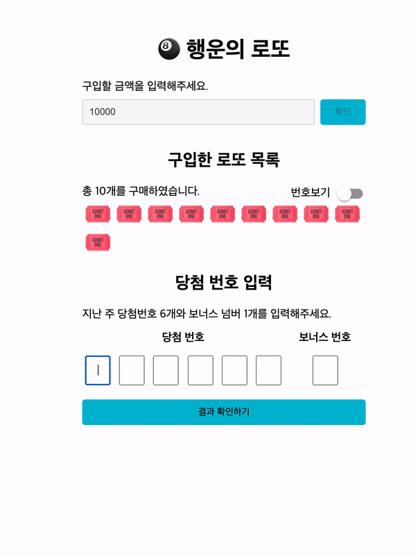

## 웹 접근성 / 웹 표준 체크 리스트

### 웹 접근성

- [x] Focusing
  - [x]사용자가 해야 할 일을 안내할 수 있게, 구매금액 -> 로또 번호입력 -> 당첨번호 입력 순으로 초점을 이동시킨다.
  - [x] 로또 숫자 입력을 할 때, 중복 에러가 발생하면 처음 중복이 발생한 곳으로 초점을 이동한다.
  - [x] 모달이 닫히면, 당첨번호의 첫 입력 란으로 초점을 이동한다.
  - [x] 버튼에 초점이 잡히면, 초점이 잡혔다는 것을 스타일 변화를 주어 표시한다. (버튼, 토글 포함)
- [x]] 키보드 사용 보장
  - [x] Enter 키를 이용하여 폼을 제출 할 수 있게 함.
  - [x] 토글 버튼 조작을 Enter키를 이용하여 조작할 수 있게 함.

### 웹 표준

- [x] 주요한 기능이 포함된 요소에는 적절한 태그명을 사용해야 한다
  - [x] 서비스 전체 기능을 담는 container div 태그를 main으로 변경
  - [x] 특정 기능을 담는 요소들을 section으로 구분.
- [x] 각 section 에는 header가 존재해야한다.
  - 각 섹션에 맞는 제목 추가
- [x] 각 input 에는 label이 붙어있어야 한다.
  - [x] label이 존재하지 않는 input폼은 aria-label로 label 대체 문구 표시
  - [x] label에는 각 input이 무엇을 입력 받는지 명시한다.
- [x] 여섯 개의 당첨번호를 입력하는 폼은 fieldset으로 묶어주고 legend로 설명을 곁들임
- [x] 하나의 HTML 문서에는 하나의 autofocus만
- [x] modal의 경우는 role="dialog" aria-modal="true" 속성 부여
- [x] modal에서 닫기 버튼에 aria-label="닫기" 부여
- [x] html 기본 속성을 최대한 이용한다. (ex. required)
